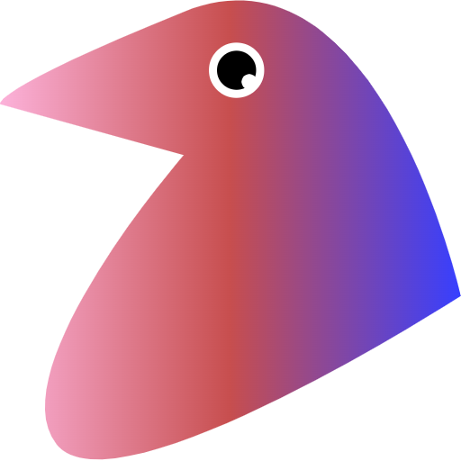
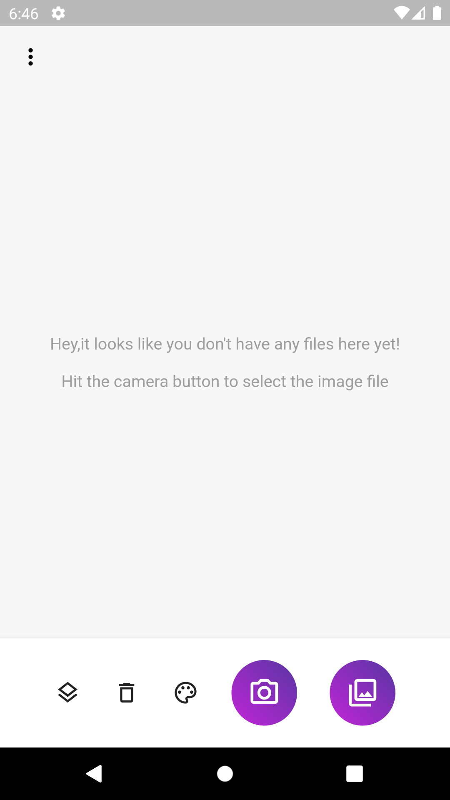
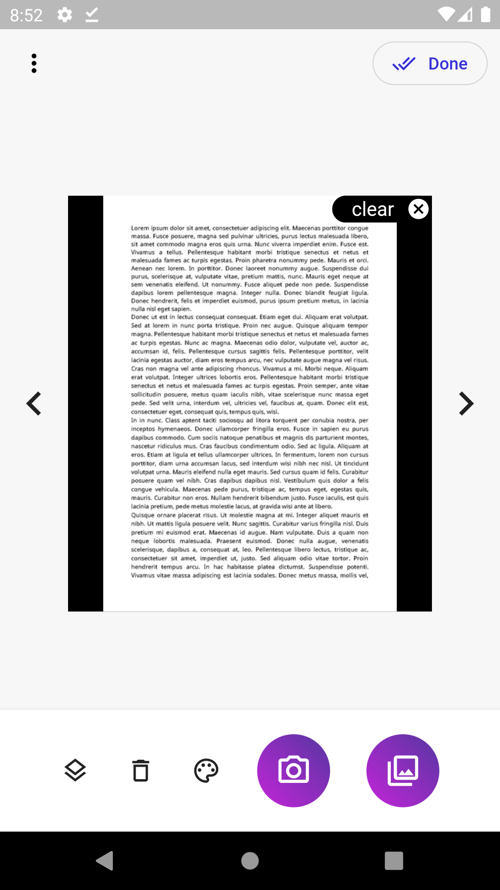

# Quail

A simple flutter app to generate pdf from the images. Also providing the option to apply filter and document rearrengement. 

# Usage

https://user-images.githubusercontent.com/70746835/161205551-05fe9708-ec72-4d95-b681-15458dcda5b1.mp4

 

Wen you first open the app, message will be shown to add images. You can use the camera or add image you already have by clicking galery button on the right side of the camera button. You can add as many images you want, and navigate throw the list of the image using the left and right controller provided at the side of the image. 

## controls

1. First from left button is for rearrenging images
2. second button is for clearing all images( you can also clear individual image by clicking on "clear" button given on each image)
3. third button is for applying different available filter.
4. Fourth button is for capturing image from the camera.
5. Fifth button is for selecting image from the file system.  

When you done with capturing images, rearrengement and applying filter, you can click on the done button given at the top right corner to generate the pdf. It will try to open the default pdf app after the pdf generated. 

